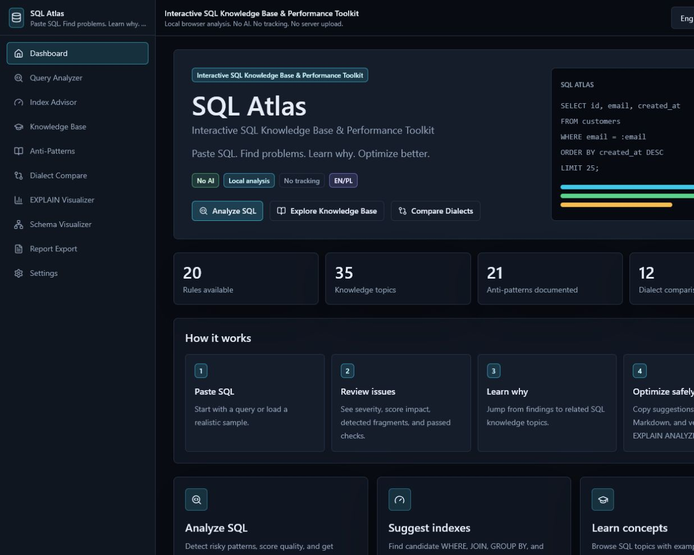
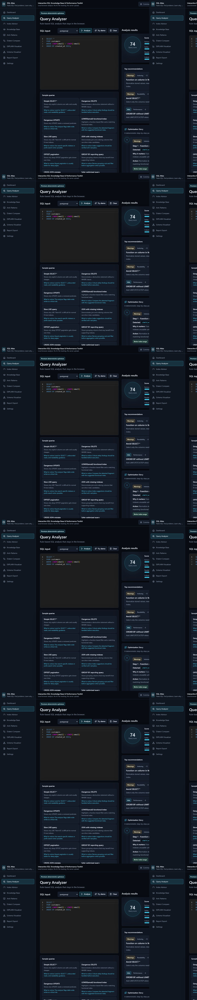
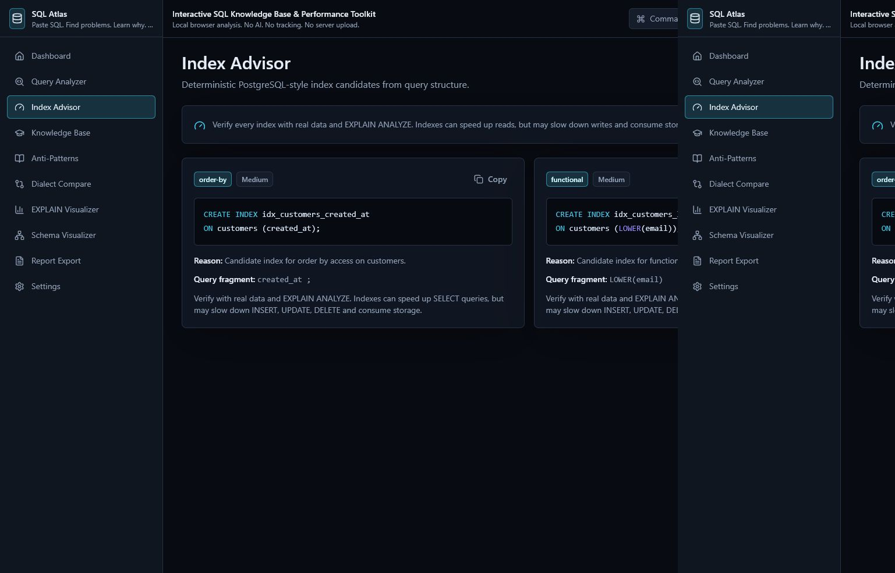
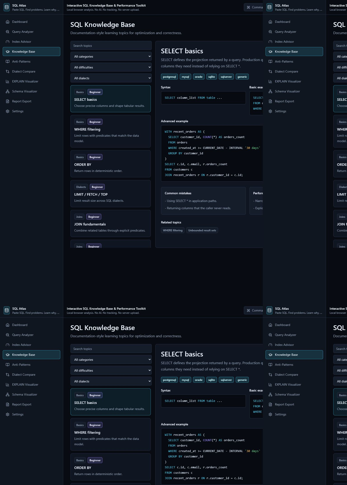
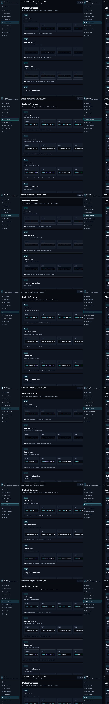

# SQL Atlas

**Interaktywna baza wiedzy SQL i narzędzie do analizy wydajności zapytań**

SQL Atlas to lokalne, bezpieczne i działające bez AI narzędzie dla developerów. Pomaga analizować zapytania SQL, wykrywać antywzorce, sugerować indeksy, porównywać dialekty SQL i uczyć się optymalizacji zapytań. Aplikacja działa w przeglądarce i nie wysyła zapytań SQL na serwer.

[](https://github.com/milekv/sql-atlas/actions/workflows/ci.yml)
[](https://milekv.github.io/sql-atlas/)
[](#prywatnosc-i-brak-ai)
[](#prywatnosc-i-brak-ai)
[](#dwujezyczny-interfejs)
[](https://react.dev/)
[](https://www.typescriptlang.org/)
[](https://vite.dev/)
[](LICENSE)

**Demo:** [https://milekv.github.io/sql-atlas/](https://milekv.github.io/sql-atlas/)

> Wklej SQL. Znajdź problemy. Zrozum dlaczego. Optymalizuj świadomie.

## Czym jest SQL Atlas?

SQL Atlas jest narzędziem dla SQL developerów, backend developerów, full-stack developerów, DBA oraz osób uczących się SQL, które chcą lepiej rozumieć wydajność zapytań. Projekt odpowiada na realny problem: zapytanie może działać, ale nadal być kosztowne, trudne do utrzymania albo ryzykowne dla danych.

Aplikacja łączy kilka warstw pracy z SQL:

- analizator zapytań,
- doradcę indeksów,
- bazę wiedzy SQL,
- bibliotekę antywzorców,
- porównanie dialektów SQL,
- eksport raportu Markdown.

SQL Atlas nie jest tylko linterem i nie jest tylko dokumentacją. Wykrywa problemy, pokazuje fragmenty zapytania, tłumaczy dlaczego dany wzorzec ma znaczenie, łączy wynik z tematami edukacyjnymi i sugeruje następne kroki. Całość działa lokalnie w przeglądarce, bez backendu i bez AI.

## Najważniejsze funkcje

| Moduł | Opis |
| --- | --- |
| **Query Analyzer / Analizator zapytań** | Statyczna, regułowa analiza SQL. Grupuje problemy według ważności, pokazuje ocenę zapytania, rozbicie wyniku, wykryte fragmenty, top rekomendacje, zaliczone kontrole i sformatowany SQL. |
| **Optimization Story / Ścieżka optymalizacji** | Gotowa funkcja analizatora. Układa wykryte problemy w kroki optymalizacji: co znaleziono, dlaczego to ważne, co zrobić i jaki może być efekt. |
| **Before / After SQL Diff / Przed / Po** | Gotowa funkcja analizatora. Pokazuje oryginalne zapytanie i bezpieczny przykład przepisania, jeśli statyczne reguły mogą zaproponować taką zmianę. |
| **Visual Query Map / Mapa zapytania** | Gotowa funkcja analizatora. Rozbija SQL na części takie jak SELECT, FROM, JOIN, WHERE, GROUP BY, HAVING, ORDER BY, LIMIT i OFFSET. |
| **Index Advisor / Doradca indeksów** | Deterministyczne sugestie indeksów na podstawie WHERE, JOIN, ORDER BY, GROUP BY oraz filtrów funkcyjnych. |
| **SQL Knowledge Base / Baza wiedzy SQL** | Dokumentacyjny moduł edukacyjny z kategoriami, poziomami trudności, przykładami, częstymi błędami i poradami wydajnościowymi. |
| **Anti-Patterns Library / Biblioteka antywzorców** | Katalog wzorców SQL, które często szkodzą wydajności, czytelności albo bezpieczeństwu danych. |
| **Dialect Compare / Porównanie dialektów SQL** | Porównanie składni i zachowania popularnych silników: PostgreSQL, MySQL, Oracle, SQLite i SQL Server. |
| **Markdown Report Export / Eksport raportu Markdown** | Eksport wyniku analizy do raportu Markdown, który można wkleić do issue, pull requesta albo dokumentacji. |
| **Command Palette / Paleta komend** | Globalna paleta `Ctrl+K` / `Cmd+K` do nawigacji, ładowania próbek, analizy SQL, zmiany języka, zmiany motywu i eksportu raportu. |
| **Try Demo / Demo na start** | Jednym kliknięciem ładuje przykładowe zapytanie z `SELECT *`, `LOWER(email)` i `ORDER BY` bez `LIMIT`, a następnie uruchamia analizę. |
| **EXPLAIN Visualizer** | Moduł planowany. Obecnie przygotowany jako placeholder pod przyszłą analizę planów `EXPLAIN JSON`. |
| **Schema Visualizer** | Moduł planowany. Obecnie przygotowany jako placeholder pod przyszłe diagramy schematu i relacji między tabelami. |

<a id="dwujezyczny-interfejs"></a>

### Dwujęzyczny interfejs

SQL Atlas obsługuje język polski i angielski. Aplikacja wykrywa język przeglądarki przy pierwszym uruchomieniu, a użytkownik może ręcznie przełączać język w interfejsie.

### Analiza lokalna

Analiza działa w przeglądarce. W wersji v1 projekt nie ma backendu, nie korzysta z AI i nie wysyła zapytań SQL na serwer.

## Co wyróżnia projekt?

SQL Atlas nie jest kolejną aplikacją CRUD. To narzędzie rozwiązujące praktyczny problem developerów: jak przejść od „to zapytanie może być wolne” do „rozumiem, co konkretnie może być problemem i jak to sprawdzić”.

Projekt wyróżnia się tym, że:

- pomaga nie tylko znaleźć problem, ale też go zrozumieć,
- łączy praktyczne reguły optymalizacyjne z edukacją,
- wskazuje powiązane tematy wiedzy SQL,
- pokazuje potencjalne konsekwencje wzorców takich jak `SELECT *`, funkcje w `WHERE`, `OFFSET`, `ORDER BY` bez limitu czy destrukcyjne zapytania bez `WHERE`,
- działa lokalnie i prywatnie,
- dobrze nadaje się jako narzędzie portfolio, projekt open-source i materiał edukacyjny.

## Przykład analizy

Przykładowe zapytanie:

```sql
SELECT *
FROM customers
WHERE LOWER(email) = 'test@example.com'
ORDER BY created_at DESC;
```

SQL Atlas może wykryć między innymi:

- **`SELECT *`** - wybieranie wszystkich kolumn może zwiększać I/O, zużycie pamięci i transfer danych.
- **`LOWER(email)` w `WHERE`** - funkcja na kolumnie może utrudnić użycie zwykłego indeksu B-tree na `email`.
- **`ORDER BY` bez `LIMIT`** - sortowanie nieograniczonego wyniku może wymagać kosztownej pracy po stronie bazy.
- **Sugestia indeksu funkcyjnego** - dla PostgreSQL przykładowo:

```sql
CREATE INDEX idx_table_lower_column
ON table_name (LOWER(column_name));
```

Analiza w SQL Atlas jest statyczna i regułowa. Wyniki należy traktować jako wskazówki do dalszej weryfikacji, a realny wpływ zmian sprawdzać na prawdziwej bazie danych przez `EXPLAIN`, `EXPLAIN ANALYZE`, metryki i dane produkcyjno-podobne.

<a id="prywatnosc-i-brak-ai"></a>

## Prywatność i brak AI

SQL Atlas celowo nie jest produktem AI.

- Nie używa AI.
- Nie korzysta z OpenAI API.
- Nie wysyła SQL na serwer.
- Nie ma trackingu.
- Nie wymaga konta użytkownika.
- Nie wymaga połączenia z bazą danych.
- Analiza działa lokalnie w przeglądarce.

Ten model jest dobry do nauki, demo, portfolio i pracy na przykładach. Nadal warto zachować ostrożność: nie należy wklejać wrażliwych produkcyjnych zapytań, nazw klientów, sekretów ani danych biznesowych do przypadkowych narzędzi online.

## Screenshoty

Poniższe screenshoty pochodzą z działającej aplikacji.

### Dashboard



### Analizator zapytań



### Doradca indeksów



### Baza wiedzy SQL



### Porównanie dialektów SQL



## Stack technologiczny

- React
- TypeScript
- Vite
- Tailwind CSS
- Monaco Editor
- sql-formatter
- Vitest
- GitHub Actions
- GitHub Pages

## Instalacja lokalna

```bash
npm install
npm run dev
npm test
npm run build
npm run preview
```

Po uruchomieniu trybu developerskiego Vite pokaże lokalny adres aplikacji, najczęściej:

```text
http://127.0.0.1:5173/
```

Na Windows PowerShell, jeśli skrypty są zablokowane, można użyć `npm.cmd`:

```bash
npm.cmd install
npm.cmd test
npm.cmd run build
```

## Deployment na GitHub Pages

Projekt jest przygotowany pod GitHub Pages i GitHub Actions.

Najważniejsze elementy:

- workflow GitHub Actions buduje aplikację i publikuje katalog `dist/`,
- konfiguracja Vite obsługuje deployment pod ścieżką `/sql-atlas/`,
- aplikacja nie używa `BrowserRouter`, więc odświeżanie strony na GitHub Pages nie wymaga osobnego `404.html`.

Konfiguracja w GitHubie:

```text
Settings -> Pages -> Build and deployment -> GitHub Actions
```

Po wypchnięciu zmian na `main` workflow `Deploy GitHub Pages` buduje i publikuje aplikację.

## Struktura projektu

```text
src/
  app/                    Provider aplikacji, stan strony, język, motyw i ostatnia analiza
  components/             Layout, paleta komend, edytor SQL i komponenty UI
  features/               Widoki i główne moduły produktu
  core/
    analyzer/             Regułowy analizator SQL, scoring i logika doświadczenia analizatora
    index-advisor/        Deterministyczne sugestie indeksów
    dialects/             Dane do porównania dialektów SQL
    explain/              Typy i przykładowy plan pod przyszły EXPLAIN Visualizer
    report-export/        Eksport raportu Markdown
  content/                Tematy wiedzy SQL i antywzorce
  i18n/                   Tłumaczenia PL/EN i wykrywanie języka
  samples/                Przykładowe zapytania SQL
  tests/                  Testy Vitest dla analizatora, indeksów, eksportu i i18n
public/
  screenshots/            Screenshoty używane w README
.github/
  workflows/              CI i deployment GitHub Pages
```

## Roadmapa

### v0.1.0

- Analizator zapytań SQL
- Doradca indeksów
- Baza wiedzy SQL
- Biblioteka antywzorców
- Porównanie dialektów SQL
- Eksport raportu Markdown
- Obsługa PL/EN
- GitHub Pages deployment

### v0.2.0

- EXPLAIN JSON Visualizer
- Wizualne drzewo planu wykonania
- Analiza operatorów takich jak Seq Scan, Index Scan, Nested Loop, Sort i Buffers

### v0.3.0

- Schema Visualizer
- Parser `CREATE TABLE`
- Wizualizacja relacji między tabelami

### v0.4.0

Planowany interfejs CLI:

```bash
npx sql-atlas analyze query.sql
```

### v0.5.0

- GitHub Action do sprawdzania plików SQL w repozytoriach

### Future

- VS Code extension
- Więcej reguł per dialekt
- Więcej tematów w bazie wiedzy
- Lokalna historia analiz

## Współtworzenie

Contributions powinny utrzymywać projekt w tym samym kierunku: lokalny, deterministyczny, dwujęzyczny i testowalny.

Przed zgłoszeniem zmian uruchom:

```bash
npm test
npm run build
```

Przy dodawaniu reguły analizatora:

- dodaj regułę w `src/core/analyzer/rules/`,
- dodaj tłumaczenia w `src/i18n/translations.ts`,
- połącz regułę z tematami wiedzy, jeśli ma to sens,
- dodaj testy w `src/tests/`.

## Autor

**Miłosz Kordziński**  
GitHub: [@milekv](https://github.com/milekv)

## Licencja

Projekt jest dostępny na licencji MIT. Szczegóły znajdują się w pliku [LICENSE](LICENSE).
